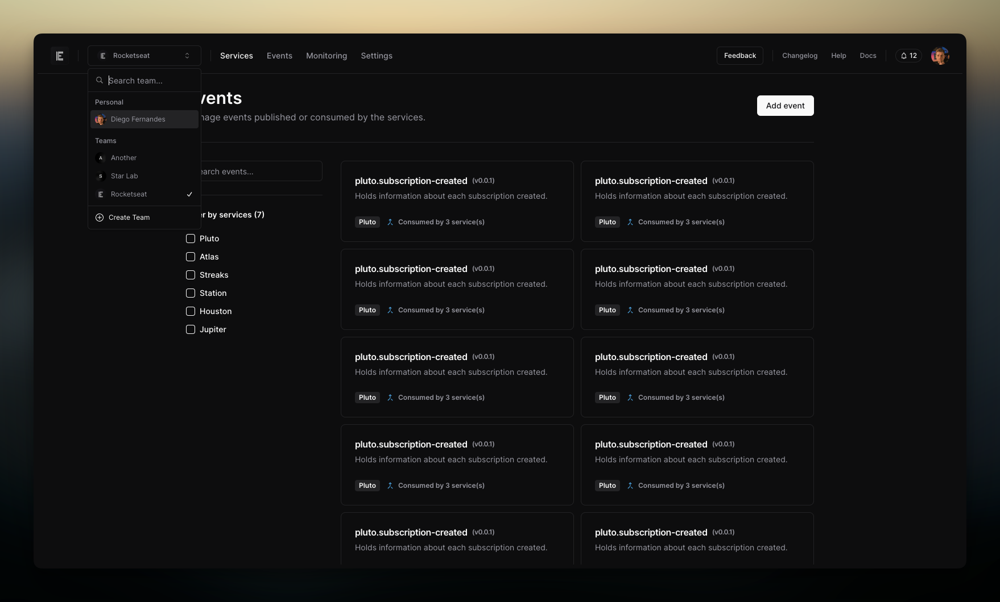

# Flowly

This is a application built with Next.js 13, Tailwind, shadcn/ui, [Clerk](https://clerk.dev?utm_source=rocketseat&utm_medium=web) and Radix UI.

## ⚠️ Under development

This application does not have functionality yet and was created only for the purpose of studies.

---

### Features

- It should be able to register a service;
- It should be able to register an event;

#### Details

- Each service can publish multiple events;
- Each service can subscribe to multiple events;
- Each event have: 
  - A optional markdown description;
  - A JSON schema;

#### Remember

- Events must always be backward compatible;
- We could generate TypeScript typings based on JSON Schema;
- We could generate Zod schema based on JSON Schema and vice versa;
- We could automatically publish NPM packages for each service and event version:
  - @flowly/{org}-{service}
- We could check for unused published data for each event based on subscribers;
